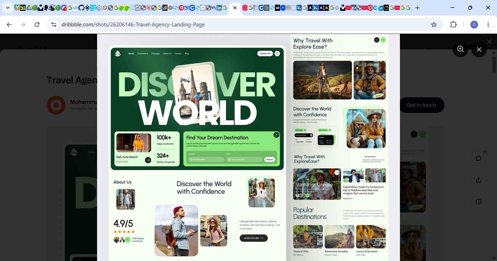

# 🌍 Discovery World

A React-based web page project exploring discovery/exploration-themed design — built as part of an ongoing series of front-end practice builds focused on clean layouts, component structure, and modern UI patterns.



## ✨ Features

- Clean, modern landing page layout
- Component-based structure for maintainability
- Responsive-in-progress UI (see Project Status below)
- Built with React

## 🛠 Tech Stack

- **React** — UI library
- **JavaScript (ES6+)**
- **CSS3** — styling and layout

## 🧭 Project Status

This project is under active development. Some sections and responsive breakpoints are still being refined.

## 🚀 Live Demo

[View Live Site](https://discoveryworld-puce.vercel.app/)

## 📦 Getting Started

### Prerequisites

Make sure you have [Node.js](https://nodejs.org/) and npm installed.

```bash
node -v
npm -v
```

### Installation

1. Clone the repository
   ```bash
   git clone https://github.com/SamuelIboi/Discovery-World.git
   ```
2. Navigate into the project folder
   ```bash
   cd Discovery-World
   ```
3. Install dependencies
   ```bash
   npm install
   ```
4. Start the development server
   ```bash
   npm start
   ```
5. Open [http://localhost:3000](http://localhost:3000) to view it in your browser.

## 📁 Project Structure

```
Discovery-World/
├── public/          # Static assets and index.html
├── src/             # React components, styles, and app logic
├── package.json     # Project metadata and dependencies
└── README.md
```

## 🤝 Contributing

Contributions, issues, and feature requests are welcome.

1. Fork the project
2. Create your feature branch (`git checkout -b feature/AmazingFeature`)
3. Commit your changes (`git commit -m 'Add some AmazingFeature'`)
4. Push to the branch (`git push origin feature/AmazingFeature`)
5. Open a Pull Request

## 📄 License

This project is open source and available under the [MIT License](LICENSE).

## 👤 Author

**Samuel Iboi**
GitHub: [@SamuelIboi](https://github.com/SamuelIboi)
Email: [kevwesamii@gmail.com](mailto:kevwesamii@gmail.com)

---

⭐️ If you like this project, consider giving it a star on GitHub!
